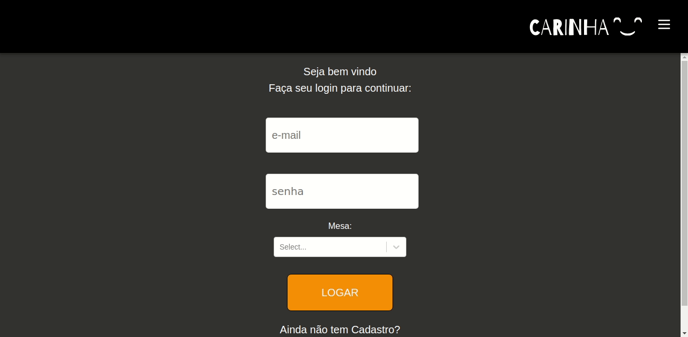

<div align="center" >
    
</div>

<div align="center"> 
    
    
    
        
</div>
<br>

<h1>Usuário:</h1>
<div align="center">
    
</div>

<br>
<h1>Admin:</h1>
<div align="center">
    
</div>

<p align="center" style="padding: 20px 0px" >
 <a href="#-grupo">Grupo</a> •
 <a href="#-mvp">MVP</a> •
 <a href="#-começando">Começando</a> •
 <a href="#-tecnologias">Tecnologias</a> •  
 <a href="#-autor">Autor</a>
</p>

# Grupo

Projeto em grupo para conclusão do front-end na Kenzie Academy Brasil.

- Lucas Morais de Sousa - Product Owner (PO)
- Henrique Delavi Daum - Scrum Master
- Denis Rafael Korb - Tech Lead
- <strong>Gabriel V. Andrian - Quality Assurance (QA)</strong>
- Joao Ricardo Cavali - Dev

# MVP

Como produto mínimo viável nossa plataforma inicialmente permitirá fazer o pedido com identificação da mesa e organizar a fila de pedidos na cozinha.

# 🚀 Começando

Esse é um exemplo de como ter uma copia e rodar o projeto localmente. Siga os passos descritos a seguir:

```bash
# Clone este repositório
$ git clone https://github.com/gabriel-andrian/restaurante-carinha

# Acesse a pasta do projeto no terminal/cmd
$ cd restaurante-carinha

# Instale as dependências
$ yarn install

# Execute a aplicação em modo de desenvolvimento
$ yarn start

# O servidor inciará na porta:3000 - acesse <http://localhost:3000>
```

# 🛠 Tecnologias

Ferramentas usadas na construção do projeto:

- [VSCode](https://code.visualstudio.com/)
- [Git](https://git-scm.com)
- [React](https://pt-br.reactjs.org/)
- [Redux](https://redux.js.org/)
- [TypeScript](https://www.typescriptlang.org/)
- [react-router-dom](https://reactrouter.com/web/guides/quick-start)
- [Styled-Components](https://styled-components.com/)
- [AntDesign](https://ant.design/)
- [Axios](https://github.com/axios/axios)

<div align="center">


   
</div>

# 👨🏽‍💻 Autor

<div align="center">
<a href="https://www.linkedin.com/in/gabriel-andrian/"> 
   
</a>

<a href="https://gitlab.com/gabriel_andrian"> 
   
</a>
</div>

## Sobre mim

Formado em Engenharia de Controle e Automação, com experiência em uma empresa focada em desenvolvimento de projetos e soluções para a área de automação industrial, onde tive maior contato com a programação, decidi então mudar de área e me tornar um programador.

Atualmente faço um curso super intensivo na Kenzie Academy Brasil de formação de 2000 horas onde estou aprendendo: HTML5, CSS3, JavaScript, Typscript, React, Node JS, Python, Flask, Django, Banco de Dados, entre outras hard skills e soft skills.
